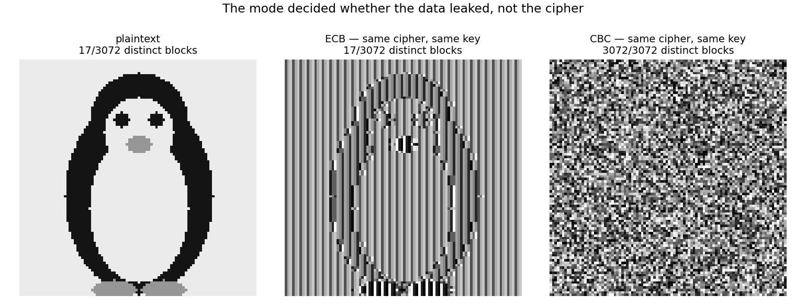

# Week 3 Studio — Modes and Misuse

Code: [`starter.py`](starter.py) (Tasks 1–3). All four provided tests pass.

```bash
cd studios/week-03
python3 test_modes.py     # 4/4 pass
python3 penguin.py        # the ECB penguin (README bonus)
```

---

## Task 1 — ECB vs CBC

`ecb_leak_count` = `distinct_blocks(ecb_encrypt(image, key))`. ECB is stateless,
so identical plaintext blocks map to identical ciphertext blocks and the count of
distinct ciphertext blocks *is* the count of distinct plaintext blocks.

| Input | Blocks | ECB distinct | CBC distinct |
|---|---|---|---|
| provided `IMAGE` | 96 | **2** | **96** |
| penguin bitmap (96×96) | 3072 | **17** — identical to the plaintext | 3072 |

Same image, same cipher, same key. Only the **mode** changed.



## Task 2 — CTR nonce reuse

`recover_second_plaintext` = `xor(xor(c1, c2), known_m1)`. Same key *and* same
nonce ⇒ same keystream ⇒ it cancels: `c1 ⊕ c2 = m1 ⊕ m2`, so `m2 = c1 ⊕ c2 ⊕ m1`.

M2 recovered in full: `b'the quarterly meeting moved to three pm'`.

Crib-dragging `b"transfer"` over `c1 ⊕ c2` — with no key and no plaintext — hits
position **0** and yields `b'the quar'`, the true start of M2: the crib sits at
its real offset in M1, so the fragment that falls out is M2 at that offset.

This is week 2's two-time pad verbatim. The mode is modern; the break is not new.
AES contributed nothing, because its guarantee was conditional and the condition
was violated.

**Fast-finisher question — unique nonce but the key reused across a million messages?**
Confidentiality holds. The condition was never "a fresh key per message", it is:
**the (key, nonce) pair must never repeat, and the counter blocks of two messages
must never overlap.** A counter-based nonce satisfies that for 10⁶ messages. A
*random* nonce only satisfies it probabilistically — 64-bit random nonces collide
by the birthday bound after roughly 2³² messages under one key, which is why
GCM specifies 96-bit nonces. Integrity is a separate question: CTR never provides
it, under any condition.

## Task 3 — Length extension

`forge_extension` replicates the hash's internal padding and resumes hashing from
the observed tag, because a Merkle–Damgård digest *is* the internal state:

```
pad        = bytes((-(secret_len + len(observed_msg))) % 4)
forged_msg = observed_msg + pad + extension
forged_tag = md_hash(extension, iv=observed_tag)
```

Knowing only `(msg, tag, len(secret))` and never the secret, the forge succeeds:

```
observed: tag over  b'amount=100&to=alice'
forged  : valid tag over  b'amount=100&to=alice\x00\x00&to=attacker'
```

The secret-holder recomputes the same tag, so the forgery verifies — the
guarantee "only the key-holder can produce a valid tag" is false.

HMAC defeats the same attempt. It nests the hashing, so the tag is the *outer*
digest and the resumable inner state never leaves the function; there is no state
to resume from. Better **construction**, not a better hash.

## Task 4 — Control Scorecard

| Construction | Guarantee (axis 2) | Its condition / failure | Primitive break or misuse? |
|---|---|---|---|
| **ECB mode** | confidentiality of an individual block only | **leaks structure** — identical plaintext blocks stay identical, so the block pattern survives 1:1 (penguin: 17/3072 distinct blocks before *and* after) | **misuse** — AES is a deterministic permutation and did exactly that |
| **CBC / CTR** | confidentiality of the message | CTR: **the (key, nonce) pair must never repeat** — else `c1 ⊕ c2 = m1 ⊕ m2` and it is a two-time pad. CBC: **the IV must be fresh and unpredictable**. Neither provides integrity | **misuse** — the mode's condition was violated, not the cipher |
| **`H(secret‖msg)` MAC** | *appears* to authenticate — "only the secret-holder can produce a valid tag" | **length extension**: the digest is the full internal state, so an attacker who knows `(msg, tag, len(secret))` resumes hashing and forges a tag for `msg ‖ pad ‖ evil` without the key | **misuse** — SHA-256 is intact; `H(k‖m)` was never a MAC |
| **HMAC** | existential unforgeability: no valid tag without the key, and no length extension | needs a **secret key**, kept secret and used only for this purpose. Says nothing about freshness — a captured `(msg, tag)` still replays | correct use |

**4 of 4 are misuses.** Not one attack needed a weakness in AES or SHA-256.

## Where we may have been unfair, and what we did not test

- **The toy `md_hash` is a 32-bit digest**, so it also has a genuine *primitive*
  break: collisions are reachable in ~2¹⁶ tries by the birthday bound. That is
  **not** the lesson here — length extension works identically against real
  SHA-256, which has no such collision. Conflating the two would be the wrong
  takeaway from this studio.
- **The toy block is 3 bytes**, so CBC ciphertext blocks can collide by chance in
  a way AES's 128-bit block never would. This exaggerates CBC's weakness, not
  ECB's — the ECB result transfers to real AES unchanged.
- **The ECB inputs are synthetic**: the provided `IMAGE` and our penguin, both
  flat-shaded. We did not test compressed or high-entropy data, where ECB leaks
  far less.
- **The attacker got more than the defender in Task 3**: unlimited forgery
  attempts, no rate limiting, and a message format that happily accepts the
  trailing null padding. A format that rejected it would blunt this specific
  forgery without fixing the construction.
- **Not tried for lack of time**: CBC padding-oracle attacks, and GCM nonce
  reuse — which is strictly worse than CTR's, since it also leaks the
  authentication subkey and destroys integrity for every message under that key.
